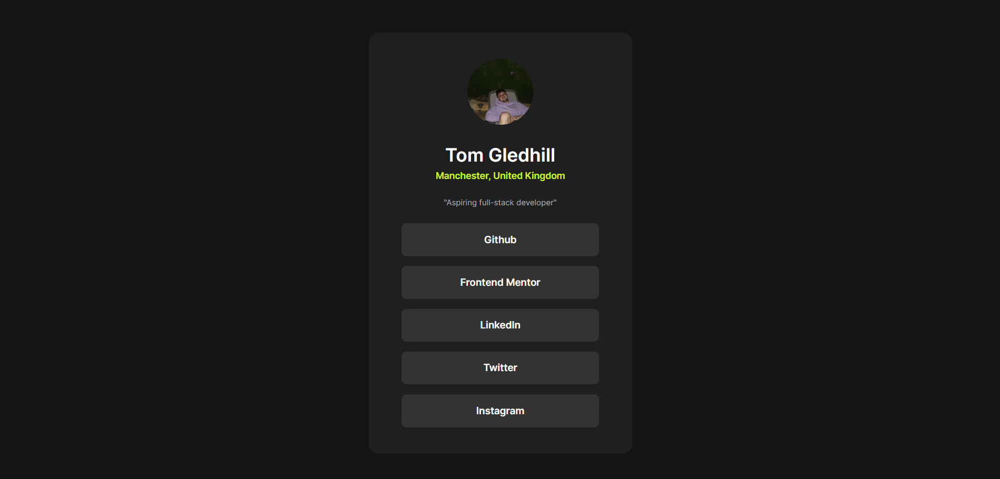

# Frontend Mentor - Social links profile solution

This is a solution to the [Social links profile challenge on Frontend Mentor](https://www.frontendmentor.io/challenges/social-links-profile-UG32l9m6dQ). Frontend Mentor challenges help you improve your coding skills by building realistic projects. 

## Table of contents

- [Overview](#overview)
  - [The challenge](#the-challenge)
  - [Screenshot](#screenshot)
  - [Links](#links)
- [My process](#my-process)
  - [Built with](#built-with)
- [Author](#author)

## Overview

Short challenge I did for fun, wanted to complete all of the Newbie stuff but I'd rather go straight to Junoir and Advanced. My social links are only tied to the Github and Frontend mentor links, the others are just the default websites.

### The challenge

Users should be able to:

- See hover and focus states for all interactive elements on the page

### Screenshot

### Links

- Solution URL: [Add solution URL here](https://github.com/tg-ivy/social-links)
- Live Site URL: [Add live site URL here](https://tg-ivy.github.io/social-links/)

## My process

### Built with

- Semantic HTML5 markup
- CSS custom properties
- Flexbox
- Mobile-first workflow
- [Normalize.css](https://necolas.github.io/normalize.css/)

### Continued development

I'll be moving to Junior and Advanced projects now, I really only did this for fun but my grasp on this stuff is there.

## Author

- Frontend Mentor - [@tg-ivy](https://www.frontendmentor.io/profile/tg-ivy)
- Github - [@tg-ivy](https://github.com/tg-ivy)